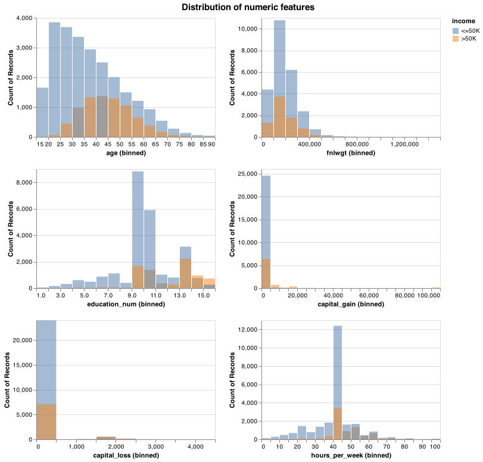
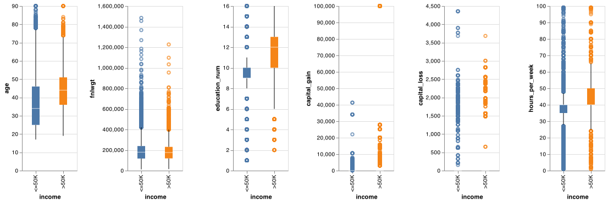
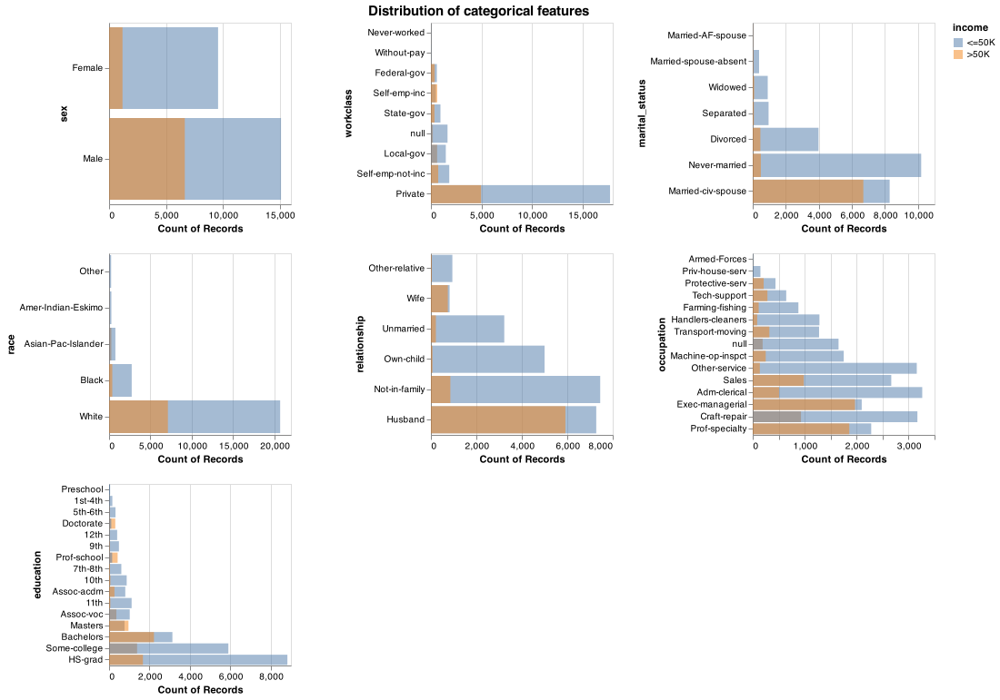
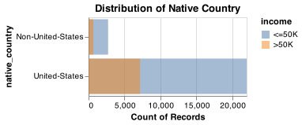
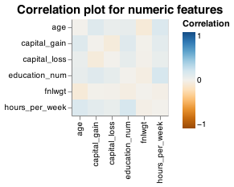
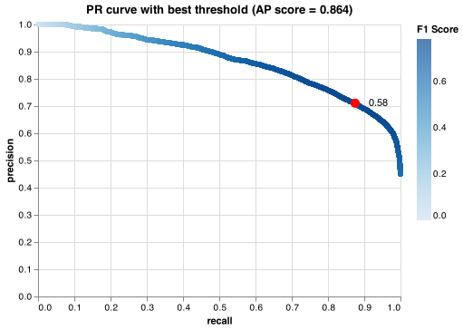

Predicting annual income from census data using demographic features
================
Affrin Sultana Navya Dahiya Philson Chan Sukhleen Kaur
25/11/2021

-   [Summary](#summary)
-   [Introduction](#introduction)
-   [Methods](#methods)
    -   [Data](#data)
    -   [Analysis](#analysis)
-   [Findings](#findings)
    -   [Feature Transformation](#feature-transformation)
    -   [Model Training](#model-training)
-   [Results](#results)
    -   [Metrics](#metrics)
-   [Limitations](#limitations)
-   [Assumptions](#assumptions)
-   [Further Development](#further-development)
-   [References](#references)

# Summary

Here we attempt to build a classification model using the
`Random Forest Classifier` algorithm (Liaw and Wiener 2002) which will
use the `Census Income` data with demographic features such as level of
education, age, hours dedicated to work, etc to predict whether a
person’s annual income will be greater than 50K or not. Our model was
able to correctly predict 83% of the test examples. Our classifier
performed fairly on unseen test data with an `ROC AUC` score of 0.89,
indicating that it is able to distinguish between the positive class
(income \> 50k) and negative class (income \<=50K) with 0.89
probability. The average `precision` score of our model on the test data
is 0.70 and `recall` score is close to 0.71, indicating that among the
people whose income is actually \>50K, we identified 70% of them
correctly and among all the people who earned more than 50K, we were
able to predict 71% of them correctly. However, it incorrectly predicted
0.064% test examples as `false positives`. These kinds of incorrect
predictions could lead people into believing that they can earn more
than 50K by following some other career path which might not be
favourable for them, thus we recommend continuing the study to improve
this prediction model before it is put into production.

# Introduction

As we progress into the future, it has become imperative to earn high to
be able to lead a good lifestyle along with enjoying luxuries. People
are curious to know what factors affect their income and based on this
analysis, how they can take decisions in their lives to earn more.

Sometimes people are not sure how the level of schooling, the number of
hours they dedicate to their work, their marital status and other
factors affect their annual income. To determine this, here we ask if we
can use a machine learning algorithm to predict whether a person will
earn more than 50K USD annually based on these factors or not. Having an
understanding of whether they will be able to earn more than 50K USD
based on some factors, can help people tweak their career decisions
early in life and come up with a plan that can help them earn more in
future. (Chakrabarty and Biswas 2018) Also, the income of a person plays
a pivotal role in the banking sector to decide whether they would grant
them loan or not based on the income level. Thus, if a machine learning
algorithm can accurately and effectively predict whether a person will
earn more than 50K USD annually, this could help people make better
decisions early in their life, until things go out of their hands.

# Methods

## Data

The data set used in this project is the Census Income Dataset, which is
also known as the Adult dataset (“Census Income” 1996), and was created
in 1996. It was sourced from the UCI Machine Learning Repository and the
data was extracted by Barry Becker using the 1994 Census database and
details of which could be found
[here](https://archive-beta.ics.uci.edu/ml/datasets/census+income).

In this dataset, each row represents a single sample from the census,
which include the demographic data of a resident. We are going to dig
into the data and explore more about the relationship between the
demographic features and their income level below.

*Reference: Census Income. (1996). UCI Machine Learning Repository.*

The training data set has 32561 observations, and no observation with
`NULL` value is found in the raw data. In the test data, there are 16281
examples. So the train-test split is roughly 2:1, i.e. the test split is
taking up around 33% of the entire data set. Below is a glimpse of few
rows from our training set and information about the datatypes and count
of records in each feature.

|   X | age | workclass        | fnlwgt | education | education_num | marital_status     | occupation        | relationship  | race  | sex    | capital_gain | capital_loss | hours_per_week | native_country | income |
|----:|----:|:-----------------|-------:|:----------|--------------:|:-------------------|:------------------|:--------------|:------|:-------|-------------:|-------------:|---------------:|:---------------|:-------|
|   0 |  39 | State-gov        |  77516 | Bachelors |            13 | Never-married      | Adm-clerical      | Not-in-family | White | Male   |         2174 |            0 |             40 | United-States  | \<=50K |
|   1 |  50 | Self-emp-not-inc |  83311 | Bachelors |            13 | Married-civ-spouse | Exec-managerial   | Husband       | White | Male   |            0 |            0 |             13 | United-States  | \<=50K |
|   2 |  38 | Private          | 215646 | HS-grad   |             9 | Divorced           | Handlers-cleaners | Not-in-family | White | Male   |            0 |            0 |             40 | United-States  | \<=50K |
|   3 |  53 | Private          | 234721 | 11th      |             7 | Married-civ-spouse | Handlers-cleaners | Husband       | Black | Male   |            0 |            0 |             40 | United-States  | \<=50K |
|   4 |  28 | Private          | 338409 | Bachelors |            13 | Married-civ-spouse | Prof-specialty    | Wife          | Black | Female |            0 |            0 |             40 | Cuba           | \<=50K |

Table 1.1 Glimpse of training data

| Column         | Non.Null | Count    | DType  |
|:---------------|---------:|:---------|:-------|
| age            |    32561 | non-null | int64  |
| workclass      |    30725 | non-null | object |
| fnlwgt         |    32561 | non-null | int64  |
| education      |    32561 | non-null | object |
| education_num  |    32561 | non-null | int64  |
| marital_status |    32561 | non-null | object |
| occupation     |    30718 | non-null | object |
| relationship   |    32561 | non-null | object |
| race           |    32561 | non-null | object |
| sex            |    32561 | non-null | object |
| capital_gain   |    32561 | non-null | int64  |
| capital_loss   |    32561 | non-null | int64  |
| hours_per_week |    32561 | non-null | int64  |
| native_country |    31978 | non-null | object |
| income         |    32561 | non-null | object |

Table 1.2 Datatypes summary for training data

Upon checking the statistical summary of each features, we found that
there were many values in this data set which were represented by `?`.
So, as part of data cleaning and wrangling, we replaced `?` with `NaN`,
after which we found that there are 1836 missing values in `workclass`,
1843 in `occupation`, and 583 in `native_country`.

During the analysis of the target column, we observed there are 24720
observations with annual income less than 50K, which is around 76% of
the training data and there are 7841 samples with income more than 50K,
which constitues for 24%. We could see class imbalance here, and decided
to solve the class imbalance problem by using the
`class_weight=balanced` hyperparameter while tuning the model
afterwards. The uneven distribution of class has been represented below.

When we performed an initial sanity check on the test dataset, we found
that all the columns in the test data were of object type. We had to
perform some additional steps to change the data types of some of the
features like `age`, `fnlwgt` to the numeric columns, to align it with
the data types of the training data set.

## Analysis

In the Exploratory Data Analysis (EDA), we tried to assess the
importance of each feature towards the prediction of the income level.
We visualized the distribution of features (both numerical and
categorical) to check if there was any potential bias in the data set so
that we could carry out suitable processing different features.

Here we are visualizing the distribution of each numeric feature of each
target class. The blue color represents the group with annual income
\<=50K USD, while the orange color represents the counterpart.

From the plots above, we can see that the features `age`,
`education_num`, `hours_per_week` are the major features which are
demarcating the difference between the two classes clearly

Below, we are visualizing key numeric features against the target class
and basically want to look out for any outliers and statistical measures
of the data.

We observe that `capital_gain` and `capital_loss` are not giving much
insight into the demarcation of the two classes

Similar to numeric features, we explored the categorical features in
order to observe the frequencies of each feature which may affect the
performance of model while detecting any of the target class.

In particular, since `native_country` had too many unique values, and
the majority of the sample were from the United States, we decided to
explore the feature as a binary feature with other countries been
assigned to `Others`, and we could see the United States still had the
super majority in this feature.

In addition to this, we also assessed the correlation among the
different features, however in this data set, all features had
correlation close to zero, indicating there are relatively independent
and could be useful for deriving an accurate prediction.

The R and Python programming languages (R Core Team 2021; Van Rossum and
Drake 2009) and the following R and Python packages were used to perform
the analysis: Pandas (team 2020), numpy (Harris et al. 2020), docopt
(Keleshev 2014), altair (Sievert 2018), knitr (Xie 2021), tidyverse
(Wickham et al. 2019), scikit-learn (Pedregosa et al. 2011), os (Van
Rossum and Drake 2009), matplotlib (Hunter 2007), seaborn(Waskom 2021) .
The code used to perform the analysis and create this report can be
found here: <https://github.com/UBC-MDS/census_income_prediction>.

# Findings

### Feature Transformation

From the EDA, it is discovered that most of the values in the column
`native_country` are `United-States`, while each of the other values
have a very little proportion and is hard for the model to derive
information. Therefore we transformed the `native_country` feature into
a binary feature, where `True` stands for the person who comes from the
US, `False` for the rest.

To transform the data frame into a ready-to-use array for the machine
learning model, we used a column transformer. In particular, we applied
`scaling` to numeric feautres, `one-hot encoding` to categorical
features, and `binary encoding` to binary features. However, from EDA,
we also found that there were null values in two of the categorical
features `workclass` and `occupation`. As it does not make sense to
impute any category to the missing value, we decided not to encode the
null value class, i.e. the `one-hot encoding` for null would be all
zero. Furthermore, we dropped the features `education`, `race`,
`capital_gain` and `capital_loss`. It is because `education_num` is
already the ordinal encoding of `education`, we did not want to
duplicate the information, and `race` shall not be considered due to
ethical controversy. Also, it was observed that `capital_gain` and
`capital_loss` were mostly zero-valued, that little information could be
exploited, so we decided to drop these columns to simplify the feature
space.

### Model Training

In this project, we are attempting to classify the income level of a
person with a `Random Forest Classifier`, which typically yields an
acceptable performance in heterogeneous data with higher dimensionality.
Since the final dimensionality of the transformed feature is 41, we
believe that random forest could give a promising performance.

To start with, we created two models - a baseline with
`Dummy Classifier` and the `Random Forest Classifier` with default
hyperparameters respectively:

| Metrics        | DummyClassifier | RandomForest_default |
|:---------------|----------------:|---------------------:|
| fit_time       |           0.074 |                2.837 |
| score_time     |           0.057 |                0.303 |
| test_accuracy  |           0.759 |                0.827 |
| test_precision |           0.000 |                0.667 |
| test_recall    |           0.000 |                0.564 |
| test_f1        |           0.000 |                0.611 |
| test_roc_auc   |           0.500 |                0.874 |

Table 2.1 Performance of Baseline Models

To further optimize the model, we investigated a few feature selection
algorithms such as `Recursive Feature Elimination (RFE)` and `Boruta`
algorithm. However, we found that these feature selection algorithms
take too long to complete since we have more than 36,000 training
examples and 40 features, so much so that it takes more than 2 hours to
tune the hyperparameters with cross validation. We also implemented
SHAPing to compute the impact of features on our model predictions but
due to the large size of the data, the execution time was not
reasonable. Hence, we decided not to apply any feature selection or
SHAPing algorithm at this stage. We might come up with an optimized way
of feature selection in the future.

Apart from feature selection, we also tuned various hyperparameters for
the `Random Forest Classifier` with 5-fold cross validation, which
includes `n_estimator` - the number of trees, `max_depth` - the maximum
depth of each decision tree, and `class_weight` to decide whether
setting a heavier weight for less populated class would yield good
results. The result of hyperparameter tuning is as follows:

| n_estimators | max_depth | class_weight | mean_test_roc_auc | mean_test_accuracy | mean_test_precision | mean_test_recall | mean_test_f1 |
|-------------:|----------:|:-------------|------------------:|-------------------:|--------------------:|-----------------:|-------------:|
|          200 |        16 | balanced     |             0.890 |              0.811 |               0.580 |            0.785 |        0.667 |
|           20 |        16 | balanced     |             0.885 |              0.811 |               0.579 |            0.785 |        0.666 |
|          100 |        18 | balanced     |             0.888 |              0.816 |               0.593 |            0.756 |        0.665 |
|          200 |        12 | balanced     |             0.891 |              0.795 |               0.549 |            0.836 |        0.663 |
|           50 |        12 | balanced     |             0.891 |              0.795 |               0.549 |            0.835 |        0.662 |
|           20 |        12 | balanced     |             0.889 |              0.796 |               0.550 |            0.828 |        0.661 |
|           10 |        18 | balanced     |             0.878 |              0.811 |               0.585 |            0.744 |        0.655 |
|           50 |        10 | balanced     |             0.889 |              0.781 |               0.528 |            0.857 |        0.653 |
|           50 |        18 | none         |             0.889 |              0.840 |               0.712 |            0.564 |        0.629 |
|          500 |        18 | none         |             0.891 |              0.840 |               0.714 |            0.562 |        0.629 |
|           50 |        16 | none         |             0.890 |              0.839 |               0.716 |            0.552 |        0.624 |
|           50 |        14 | none         |             0.892 |              0.840 |               0.724 |            0.545 |        0.622 |
|           20 |        14 | none         |             0.890 |              0.839 |               0.721 |            0.543 |        0.619 |
|          100 |        14 | none         |             0.892 |              0.840 |               0.724 |            0.541 |        0.619 |
|           10 |        16 | none         |             0.882 |              0.835 |               0.702 |            0.547 |        0.615 |
|           10 |        14 | none         |             0.886 |              0.835 |               0.707 |            0.539 |        0.611 |
|          500 |        12 | none         |             0.892 |              0.838 |               0.731 |            0.520 |        0.608 |
|           10 |        12 | none         |             0.886 |              0.836 |               0.716 |            0.528 |        0.607 |
|           20 |        10 | none         |             0.888 |              0.835 |               0.732 |            0.501 |        0.594 |
|          100 |        10 | none         |             0.890 |              0.836 |               0.735 |            0.498 |        0.594 |

Table 2.2 Results of Hyperparameter Tuning

So fundamentally, it is clear that setting `class_weight` to `balanced`
(while handling the class imbalance at the same time) would boost the
`ROC_AUC score`, `Recall score` and `F1 score`, while sacrificing
`accuracy` and `precision`. Although both target class have equal
importance in this dataset, we would also choose to optimize the
`ROC_AUC score` due to the serious class imbalance, as accuracy cannot
reflect the genuine performance of the model. Hence the model selected
is the model with `n_estimator=200`, `max_depth=16` and
`class_weight=balanced`.

# Results

### Metrics

| Model      | Accuracy | Precision | Recall | F1_Score | AP_Score | AUC_Score |
|:-----------|---------:|----------:|-------:|---------:|---------:|----------:|
| Train Data |    0.868 |     0.660 |  0.934 |    0.774 |    0.864 |     0.956 |
| Test Data  |    0.811 |     0.572 |  0.789 |    0.663 |    0.710 |     0.891 |

Table 3.1 Performance of the best model on training & testing data

Although it seems that the testing performance of the model is worse
than the training scores, our model actually has a similar performance
as the cross validation results, indicating that the model does not
overfit on the training data.

| Class      | Predicted_less_than_50K | Predicted_greater_than_50K |
|:-----------|------------------------:|---------------------------:|
| True\<=50K |                   10161 |                       2274 |
| True>50K   |                     810 |                       3036 |

Table 3.2 Confusion Matrix on testing data

| Class        | precision | recall | f1-score | support |
|:-------------|----------:|-------:|---------:|--------:|
| \<=50K       |     0.926 |  0.817 |    0.868 |   12435 |
| \>50K        |     0.572 |  0.789 |    0.663 |    3846 |
| accuracy     |     0.811 |  0.811 |    0.811 |       0 |
| macro avg    |     0.749 |  0.803 |    0.766 |   16281 |
| weighted avg |     0.842 |  0.811 |    0.820 |   16281 |

Table 3.3 Classification Report on testing data

From both classification report and the confusion matrix, we can see
that the model performs much better in the negative class, i.e. `<=50K`,
that its counterpart. Since the number of `false positive` is greater
than that of `false negative`, our model would be slightly
overestimating the income level of a person.

| Model with best threshold | Test.Data.Metrics |
|:--------------------------|------------------:|
| Accuracy                  |             0.828 |
| Precision                 |             0.616 |
| Recall                    |             0.719 |
| F1_Score                  |             0.663 |
| Average_Precision_Score   |             0.710 |
| AUC_Score                 |             0.891 |

Table 3.4 Model performance on testing data with best threshold

Since the `Random Forest Model` could also produce a probability score,
it is possible for us to determine an optimal threshold value to better
distinguish the classes. From the `PR curve`, we could see that 0.35 is
the best threshold value with training data. When we apply the new
threshold to the test data set, the `F1 score` did not change a lot,
while the `accuracy` score has improved. Thus using the best threshold
could slightly improve the decision made by the model.

Looking at the `Receiver Operating Characteristic (ROC)` curve, we could
also analyze the performance of the classifier at different threshold
level, while the `Area under curve (AUC)` score is one of the metrics
that could evaluate the model performance with high class imbalance. Our
model achieved 0.89 in `AUC`, which indicates that it has a relatively
good performance in accurately detecting both classes.

# Limitations

-   One of the major limitations of the `Random Forest Classifier` model
    is that a large number of trees can make the algorithm too slow and
    ineffective for real-time predictions.
-   Our problem statement was classification based with equal weights
    for both income groups in the target column. However, we had to
    focus on optimizing metrics ideal for spotting such as f1 score,
    precision and recall due to class imbalance.
-   Due to large size of training data, we could not perform feature
    selection or SHAPing at this stage.

# Assumptions

-   We assume that there is no multicollinearity between the features.
-   Since the Random Forest Classifier leverages bootstrap aggregation,
    we assume that the sample generated is representative of the
    population dataset.

# Further Development

To further improve the prediction result in the future, there are a few
different approaches we could try.

First we could try different types of classification models. One model
we would try is support vector machine (SVM) with RBF kernel since it
could transform the features to hyperplanes with higher dimension, which
could possibly discover a better decision boundary for the predictive
problem. Another model we would want to try is multi-layer perceptron,
i.e. a simple neural network. As it introduces non-linearity
transformation to the output of each perceptron, the overall model would
have a higher degree of freedom, thus might be able to formulate a
better decision rule for the classification.

Another approach would be feature selection and feature engineering In
our analysis, some of the features are dropped due to a bad distribution
but they might also contain import information. For instance, we could
transform `capital_gain` and `capital_loss` into ordinal categorical
features, or group `native_country` by continents. After that, we could
also generate feature with higher power, and make use of RFE algorithm
to select features with top importance and try to boost the performance
of the model.

# References

“Census Income.” 1996. UCI Machine Learning Repository.

Chakrabarty, Navoneel, and Sanket Biswas. 2018. “A Statistical Approach
to Adult Census Income Level Prediction.” In *2018 International
Conference on Advances in Computing, Communication Control and
Networking (ICACCCN)*, 207–12. IEEE.

Harris, Charles R., K. Jarrod Millman, Stéfan J. van der Walt, Ralf
Gommers, Pauli Virtanen, David Cournapeau, Eric Wieser, et al. 2020.
“Array Programming with NumPy.” *Nature* 585 (7825): 357–62.
<https://doi.org/10.1038/s41586-020-2649-2>.

Hunter, J. D. 2007. “Matplotlib: A 2d Graphics Environment.” *Computing
in Science & Engineering* 9 (3): 90–95.
<https://doi.org/10.1109/MCSE.2007.55>.

Keleshev, Vladimir. 2014. *Docopt: Command-Line Interface Description
Language*. <https://github.com/docopt/docopt>.

Liaw, Andy, and Matthew Wiener. 2002. “Classification and Regression by
randomForest.” *R News* 2 (3): 18–22.
<https://CRAN.R-project.org/doc/Rnews/>.

Pedregosa, F., G. Varoquaux, A. Gramfort, V. Michel, B. Thirion, O.
Grisel, M. Blondel, et al. 2011. “Scikit-Learn: Machine Learning in
Python.” *Journal of Machine Learning Research* 12: 2825–30.

R Core Team. 2021. *R: A Language and Environment for Statistical
Computing*. Vienna, Austria: R Foundation for Statistical Computing.
<https://www.R-project.org/>.

Sievert, Jacob VanderPlas AND Brian E. Granger AND Jeffrey Heer AND
Dominik Moritz AND Kanit Wongsuphasawat AND Arvind Satyanarayan AND
Eitan Lees AND Ilia Timofeev AND Ben Welsh AND Scott. 2018. “Altair:
Interactive Statistical Visualizations for Python.” *The Journal of Open
Source Software* 3 (32). <http://idl.cs.washington.edu/papers/altair>.

team, The pandas development. 2020. *Pandas-Dev/Pandas: Pandas* (version
latest). Zenodo. <https://doi.org/10.5281/zenodo.3509134>.

Van Rossum, Guido, and Fred L. Drake. 2009. *Python 3 Reference Manual*.
Scotts Valley, CA: CreateSpace.

Waskom, Michael L. 2021. “Seaborn: Statistical Data Visualization.”
*Journal of Open Source Software* 6 (60): 3021.
<https://doi.org/10.21105/joss.03021>.

Wickham, Hadley, Mara Averick, Jennifer Bryan, Winston Chang, Lucy
D’Agostino McGowan, Romain François, Garrett Grolemund, et al. 2019.
“Welcome to the tidyverse.” *Journal of Open
Source Software* 4 (43): 1686. <https://doi.org/10.21105/joss.01686>.

Xie, Yihui. 2021. *Knitr: A General-Purpose Package for Dynamic Report
Generation in r*. <https://yihui.org/knitr/>.

